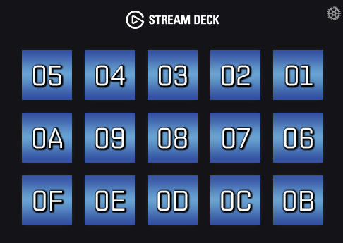

# Notes

## Button Map

The Stream Deck uses Hex HID values to map to its buttons. Their Hex values range from `01` - `0F`.



## Startup

## The Current State

On startup the Stream Deck sends the current state as a Report, with id 2. Its the exact same format as the write operation.

## Report ID 5

After sending the initial state, the Stream Deck software sends this report: `[0x05, 0x55, 0xAA, 0xD1, 0x01, 0x63, 0x00, 0x00, 0x00, 0x00, 0x00, 0x00, 0x00, 0x00, 0x00, 0x00, 0x00]`

It is unknown what this does.

## Writing an Image

### Image Format

Image format is raw BGR **NOT** RGB values.

### Image Size

72 x 72 pixels

Writing an image is sent as an `OUPUT` report. The first few bytes are easy to figure out, here's the first page of our red square:
`02 01 01 00 00 06`

1. `02`: This is the report id, for writing an image its always 2.
1. `01`: Unknown but never changes
1. `01`: "Page" number. Each image is sent as 2 pages.
1. `00`: This is padding
1. `00`: This is `01` on the second page, Presumably its used to signal that the data is a continuation from the first page
1. `06`: Hex value for the Button

The rest of the data before image data is unknown but a second page's prefix bytes look like this:

`02 01 02 00 01 06`

Where the only two changes are items 3 and 5.

### First Page Prefix

```
02 01 01 00 00 06 00 00 00 00 00 00 00 00 00 00 42 4D F6 3C 00 00 00 00 00 00 36 00 00 00 28 00 00 00 48 00 00 00 48 00 00 00 01 00 18 00 00 00 00 00 C0 3C 00 00 C4 0E 00 00 C4 0E 00 00 00 00 00 00 00 00 00 00 00 00
```

### Second Page Prefix
`02 01 02 00 01 06 00 00 00 00 00 00 00 00 00 00 00 00`
